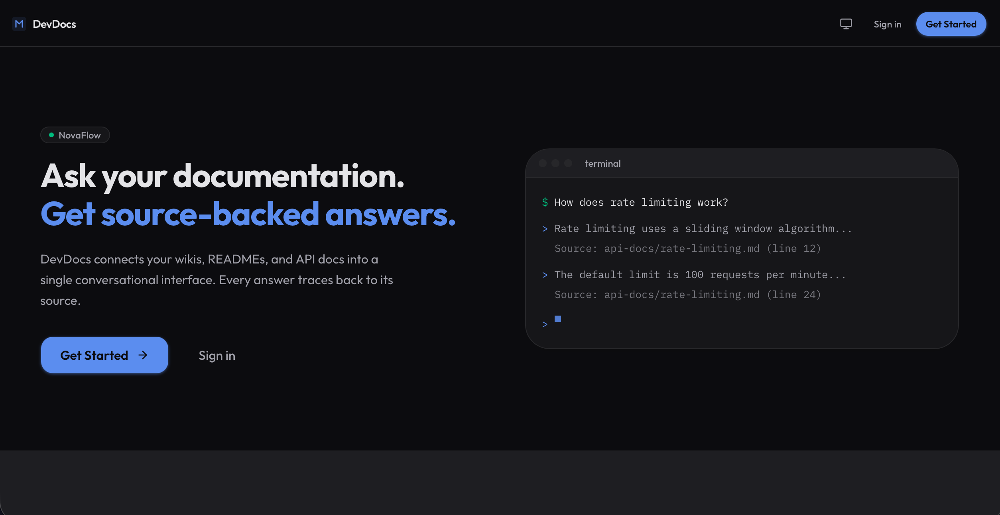
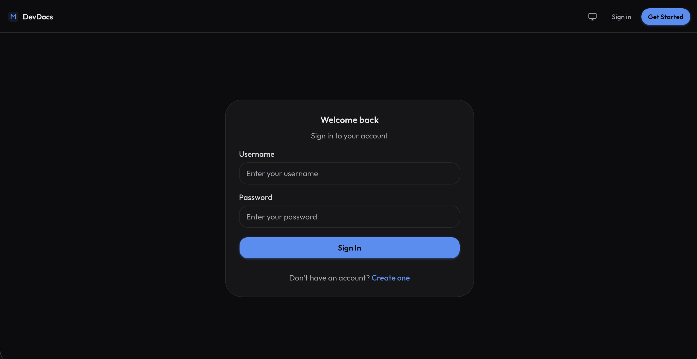
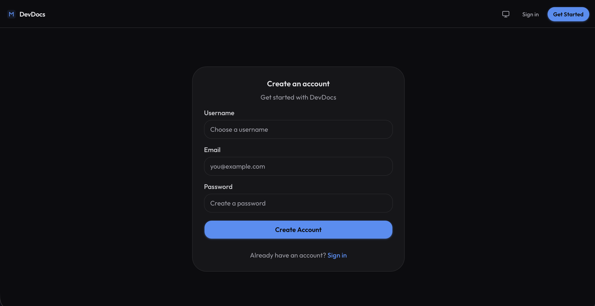
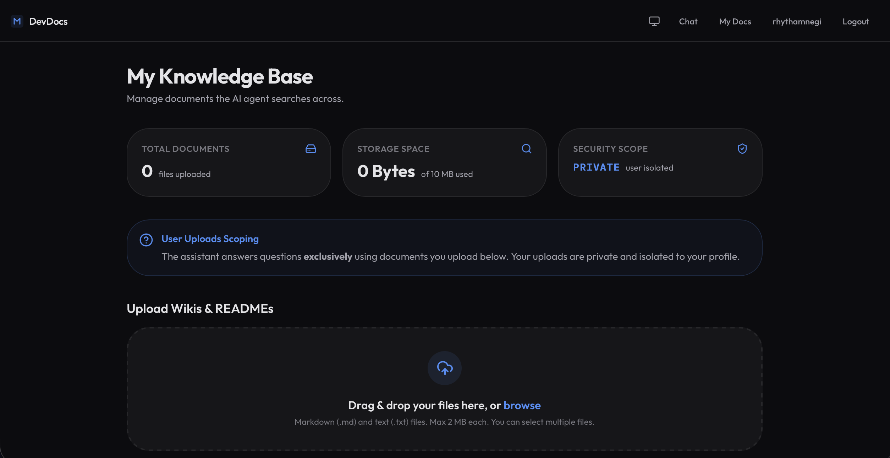
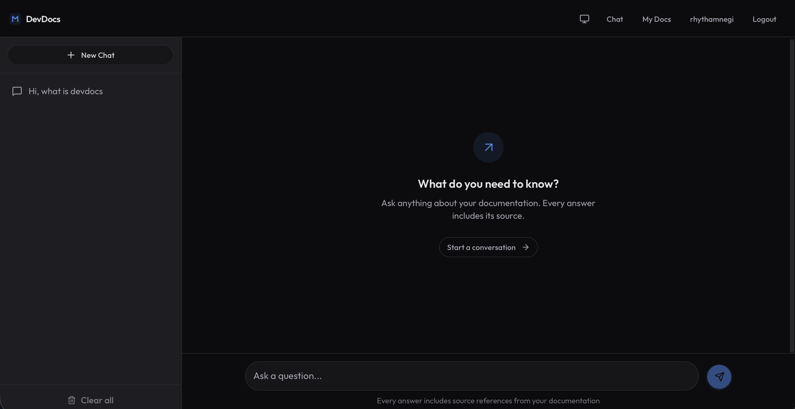

# DevDocs Agent

**Upload your system design docs. Ask questions. Get cited answers.**

An AI-powered documentation assistant that lets developers upload markdown and text files, then ask natural language questions against that knowledge base. Every answer is backed by source citations from your own documents — no hallucinated references, no black-box summaries.

---

## Screenshots

### 🏠 Landing Page


### 🔐 Authentication
| Login | Sign Up |
| :---: | :---: |
|  |  |

### 📁 Document Management


### 💬 Chat Interface (with Tool Execution Transparency)


---

## Why This Exists

Engineering teams accumulate critical knowledge in scattered markdown files — design docs, ADRs, onboarding guides, API references. Searching these manually is slow. Feeding them into a generic chatbot loses source attribution. RAG pipelines with vector databases work but introduce embedding costs, index maintenance, and infrastructure complexity that's overkill for most team documentation.

DevDocs Agent takes a different approach: **grep-first retrieval**. The agent discovers files, regex-searches them, and reads only the relevant sections — no embeddings, no vector store, no chunking pipeline. It's simpler, cheaper, and gives the LLM enough structural context to synthesize accurate, cited answers.

---

## What Makes It Stand Out

| Feature | Detail |
|---|---|
| **No vector database** | File-system-native retrieval via `list` → `grep` → `read`. Avoids embedding costs and index maintenance while leveraging the LLM's ability to reason about file structure. |
| **User-level filesystem isolation** | Python `ContextVar` scopes every tool call to the current user's upload directory. Clean, thread-safe multi-tenant isolation without separate containers. |
| **Multi-key round-robin** | Keymesh rotates multiple API keys with automatic 429 detection. Higher throughput and resilience against per-key rate limits. |
| **Session summary compression** | After every 4 conversation turns, a smaller model (Llama 4 Scout) generates a summary, compressing chat history by ~36% and reducing token costs for long sessions. |
| **Degraded mode** | If the agent fails to initialize (missing keys, network issues), auth and document endpoints still serve. Health endpoint reports `degraded` status. |
| **SSE streaming with tool-call visibility** | Real-time streaming shows tool calls (`grep`, `read_doc`) as collapsible cards in the UI — users see exactly how the agent found its answer. |
| **Retry mechanism** | `/chats/retry` pops the last run and re-submits the original prompt. Clean UX without client-side duplication. |

---

## Architecture

```
┌─────────────────────────────────────────────────────────────┐
│                       Frontend                              │
│               Next.js 16 · React 19 · TailwindCSS          │
│                    Port 3000                                │
└──────────────────────────┬──────────────────────────────────┘
                           │ REST + SSE
                           ▼
┌─────────────────────────────────────────────────────────────┐
│                       Backend                               │
│              FastAPI · Python 3.12+ · uv                    │
│                    Port 8000                                │
└──────┬──────────────┬──────────────────┬────────────────────┘
       │              │                  │
       ▼              ▼                  ▼
┌────────────┐ ┌─────────────┐ ┌──────────────────────┐
│  MongoDB 7 │ │  Agno Agent │ │    Filesystem        │
│  users,    │ │  (LLM +     │ │  docs/uploads/       │
│  sessions, │ │   tools)    │ │  <username>/         │
│  history   │ │             │ │                      │
└────────────┘ └──────┬──────┘ └──────────────────────┘
                      │
               ┌──────▼──────┐
               │  Groq API   │
               │  qwen3-32b  │
               │  (OpenAI    │
               │  compat)    │
               └─────────────┘
```

### Agent Tools

The agent has 4 tools that operate on the user's filesystem:

| Tool | Purpose |
|---|---|
| `list_all_docs(pattern)` | Discover available `.md` / `.txt` files |
| `grep(pattern, max_results)` | Regex search across all docs, returns matching lines with file + line numbers |
| `read_doc(path)` | Read an entire document |
| `read_slice_doc(path, start, end)` | Read a specific line range — targeted context without loading the whole file |

**How it works:** The agent calls `list_all_docs` to see what's available, `grep` to find relevant sections, then `read_doc` or `read_slice_doc` to pull context. It synthesizes an answer with citations — never returning raw search results without explanation.

---

## Tech Stack

| Layer | Technology |
|---|---|
| Frontend | Next.js 16, React 19, TypeScript, TailwindCSS 4, shadcn/ui |
| Backend | FastAPI, Python 3.12+, uv |
| Agent Framework | Agno v2.6.9+ |
| LLM | qwen3-32b via Groq (swappable via env var) |
| Database | MongoDB 7 (pymongo async) |
| Auth | JWT (PyJWT) + Argon2id (pwdlib) |
| Rate Limiting | Slowapi (in-memory, per-user) |
| API Key Mgmt | Keymesh (round-robin) |
| Observability | AgentOps |
| Deployment | Docker Compose (3 services) |

---

## Quick Start

### Docker (recommended)

```bash
# 1. Clone and configure
git clone <repo-url> && cd devdocs-agent
cp .env.example .env   # edit with your API keys

# 2. Start everything
docker compose up --build

# 3. Open
# Frontend: http://localhost:3000
# Backend API docs: http://localhost:8000/api/docs
```

### Local Development

```bash
# Prerequisites: Python 3.12+, Node.js, uv, MongoDB running locally

# 1. Configure environment
cp .env.example .env   # edit with your API keys

# 2. Start both servers
./start.sh
# OR manually:
cd backend && uv sync && uv run dev   # :8000
cd frontend && npm install && npm run dev  # :3000
```

### Frontend Mock Mode

For frontend-only development without a backend:

```bash
# In .env (frontend)
NEXT_PUBLIC_MOCK_MODE=true
```

Mock credentials: `admin` / `admin`

---

## Configuration

| Variable | Description | Default |
|---|---|---|
| `OPENAI_API_KEYS` | Comma-separated API keys (Groq or OpenAI-compatible) | — |
| `OPENAI_BASE_URL` | LLM API base URL | `https://api.groq.com/openai/v1` |
| `OPENAI_MODEL` | Model identifier | `qwen/qwen3-32b` |
| `AGENTOPS_API_KEY` | AgentOps observability key | — |
| `MONGO_DB_URL` | MongoDB connection string | `mongodb://localhost:27017` |
| `MONGO_DATABASE_NAME` | Database name | `docs-agent-db` |
| `JWT_SECRET` | Secret for JWT signing | — |
| `JWT_EXPIRE_IN_MINUTES` | Token lifetime | `15` |
| `ALLOW_ORIGINS` | CORS origins (comma-separated) | `http://localhost:3000` |
| `NEXT_PUBLIC_API_URL` | Backend URL (frontend) | `http://localhost:8000` |

---

## API Reference

### Authentication

| Method | Endpoint | Rate Limit | Description |
|---|---|---|---|
| `POST` | `/auth/signup` | 5/min | Register (username, email, password) |
| `POST` | `/auth/login` | 10/min | Login (OAuth2 password form) → JWT |
| `GET` | `/auth/me` | — | Current user profile |

### Chat

| Method | Endpoint | Rate Limit | Description |
|---|---|---|---|
| `POST` | `/ask` | 20/min | Non-streaming agent query |
| `POST` | `/ask/stream` | 10/min | Streaming agent query (SSE) |
| `GET` | `/chats` | 30/min | Chat history for a session |
| `POST` | `/chats/retry` | 3/min, 15/day | Retry last message |

### Documents

| Method | Endpoint | Rate Limit | Description |
|---|---|---|---|
| `POST` | `/docs/upload` | 5/min | Upload `.md` / `.txt` (max 2MB) |
| `GET` | `/docs` | 30/min | List user documents |
| `DELETE` | `/docs/{filename}` | 10/min | Delete a document |

### System

| Method | Endpoint | Description |
|---|---|---|
| `GET` | `/health` | Health check (`ok` / `degraded`) |
| `GET` | `/api/docs` | Swagger UI |
| `GET` | `/api/redoc` | ReDoc |

---

## Project Structure

```
devdocs-agent/
├── backend/
│   ├── main.py                  # FastAPI app, middleware, startup
│   ├── agent.py                 # Agno agent config + prompt
│   ├── router.py                # API route handlers
│   ├── schema.py                # Pydantic models
│   ├── core/
│   │   ├── config.py            # Pydantic settings (env vars)
│   │   ├── state.py             # Global AppState (agent, db, limiter)
│   │   └── logger.py            # Logging setup
│   ├── utils/
│   │   ├── tools.py             # 4 agent tools (list, grep, read)
│   │   ├── auth.py              # JWT + Argon2id auth
│   │   └── file_handler.py      # Upload/save/delete/list files
│   ├── docs/uploads/            # User-uploaded documents
│   └── pyproject.toml
├── frontend/
│   ├── src/
│   │   ├── app/                 # Next.js App Router pages
│   │   │   ├── chat/            # Chat page (SSE streaming)
│   │   │   ├── docs/            # Document management
│   │   │   ├── login/           # Login page
│   │   │   ├── signup/          # Signup page
│   │   │   ├── profile/         # Profile page
│   │   │   └── page.tsx         # Landing page
│   │   ├── components/          # UI components (chat, docs, layout, ui)
│   │   ├── contexts/            # AuthContext
│   │   ├── hooks/               # useChatHistory
│   │   └── lib/api.ts           # API client + SSE parser
│   └── package.json
├── docker-compose.yml           # 3-service deployment
├── start.sh                     # Local dev launcher
└── .env                         # Environment config
```

---

## Deployment

### Docker Compose

```bash
docker compose up --build -d
```

- **MongoDB** data persisted via `mongo_data` volume
- **Uploads** persisted via `uploads_data` volume
- Backend health check: `GET /health`
- Frontend builds with `NEXT_PUBLIC_API_URL` baked in

### Environment Notes

- The LLM model is swappable — set `OPENAI_MODEL` to any model available on your provider
- Multiple API keys are supported — comma-separate them in `OPENAI_API_KEYS`
- JWT tokens expire after 15 minutes by default (configurable via `JWT_EXPIRE_IN_MINUTES`)

---

## License

MIT
